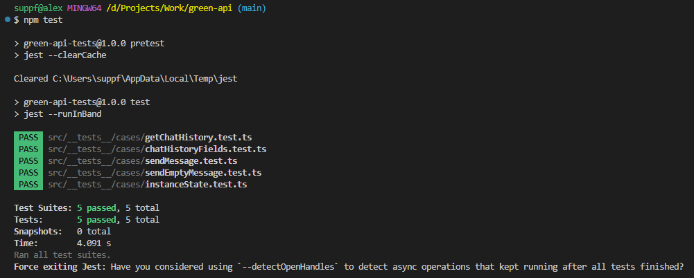

# Автотесты для WhatsApp с использованием GREEN-API

## Описание проекта

Проект представляет собой набор автотестов для отправки и получения текстовых сообщений в WhatsApp с использованием сервиса [GREEN-API](https://green-api.com/).

## Используемые технологии

- **Jest**: для написания и выполнения тестов.
- **TypeScript**: для обеспечения типизации и повышения надежности кода.
- **GREEN-API**: для взаимодействия с WhatsApp.

## Настройка проекта

1. **Установка зависимостей**:
   Убедитесь, что у вас установлен Node.js. Затем выполните команду:
   ```bash
   npm install
   ```

2. **Конфигурация окружения**:
   Создайте файл `.env` в корневой директории проекта и добавьте следующие переменные:
   ```
   API_URL=https://xxxx.api.greenapi.com
   GREEN_API_TOKEN=ваш_токен
   GREEN_API_INSTANCE_ID=ваш_id_инстанса
   CHAT_ID=77474372222@c.us
   ```
   `API_URL`, `GREEN_API_TOKEN` и `GREEN_API_INSTANCE_ID` можно получить создав инстанс по адресу: https://console.green-api.com/instanceList.
   
   `CHAT_ID` - номер телефона пользователя WhatsApp, на который будут приходить сообщения (@c.us — личный чат с номером; @g.us — групповой чат, созданный в WhatsApp).
   
## Запуск тестов

- **Запуск всех тестов**:
  ```bash
  npm test
  ```

- **Запуск отдельного теста**:
  Для запуска конкретного теста используйте команду:
  ```bash
  npm test имя_теста
  ```
  Например, npm test sendEmptyMessage

## Дополнительная информация

- **Конфигурация Jest**: находится в файле `jest.config.js`.
- **Типы и конфигурации TypeScript**: определены в файле `tsconfig.json`.

## Реализованные функции и тесты

В рамках данного проекта были реализованы следующие функции и тесты:

- **Отправка сообщений**: Реализована отправка текстовых сообщений с использованием метода [SendMessage](https://green-api.com/docs/api/sending/SendMessage/).
- **Получение сообщений**: Реализовано получение текстовых сообщений с использованием метода [getChatHistory](https://green-api.com/docs/api/journals/GetChatHistory/).
- **Проверка статуса инстанса**: Автотесты проверяют, что инстанс авторизован с помощью метода [getStateInstance](https://green-api.com/docs/api/account/GetStateInstance/).
- **Проверка статус кодов**: Автотесты проверяют статус коды 200 и 400.
- **Проверка обязательных полей**: Автотесты проверяют наличие обязательных полей в запросах.

## Структура проекта

```bash
.
├── .git/                  
├── node_modules/          
├── src/                   
│   ├── __tests__/        
│   │   ├── cases/         # Тест кейсы
│   │   └── utils/         # Утилиты и вспомогательные функции для тестов
│   │
│   └── core/              # Основные модули и компоненты проекта
│       ├── config/        # Загрузка конфига
│       ├── services/      # Сервисы и бизнес-логика
│       ├── models/        # Модели данных (Message - text only)
│       └── interfaces/    # Интерфейсы и типы данных
├── .gitignore            
├── jest.config.js         # Конфигурационный файл для Jest
├── package.json           # Метаданные проекта и список зависимостей
├── package-lock.json     
├── README.md            
└── tsconfig.json          # Конфигурационный файл для TypeScript
```

## Результаты тестов




